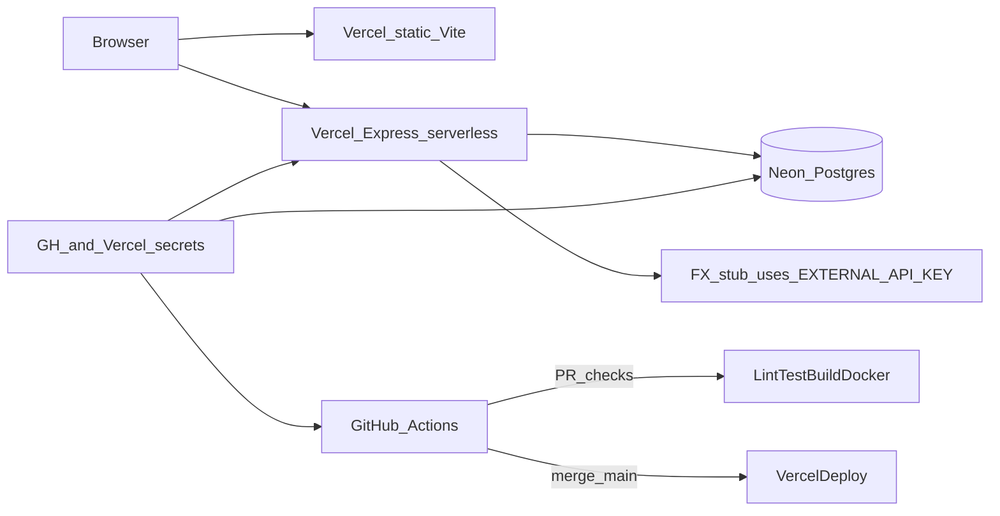

# Act1: Postgres, CI/CD, Vercel + Skills/Harness

## Defaults (locked)

- **Host**: [Vercel](https://vercel.com) for the full app (Vite static + Express as a serverless Node entry). **Neon** free-tier Postgres for `DATABASE_URL`.
- **Docker**: still built/validated on every PR (README gate). Production does **not** run that image — Vercel runs Node serverless. Call this out in `NOTES.md`.
- **Skills**: project skills under [`.cursor/skills/`](.cursor/skills/) (shared with the repo).
- **Harness**: Node acceptance checker under [`harness/`](harness/) that verifies requirements locally and as a CI job.



---

## 1. Data layer → PostgreSQL

### Schema

```sql
CREATE TABLE items (
  id         SERIAL PRIMARY KEY,
  name       TEXT NOT NULL,
  category   TEXT NOT NULL,
  price      NUMERIC(10,2) NOT NULL,
  in_stock   BOOLEAN NOT NULL DEFAULT true
);
-- map in_stock → inStock in JS (camelCase API unchanged)
```

### Migration / seed (real artifacts, not console DDL)

Add under [`backend/db/`](backend/db/):

| Path | Role |
|------|------|
| `migrations/001_create_items.sql` | `CREATE TABLE` |
| `seed/001_seed_items.sql` | The 12 current catalog rows from [`backend/data/items.js`](backend/data/items.js) |
| `migrate.js` | Applies pending SQL files in order; tracks `schema_migrations` |
| `seed.js` | Idempotent seed (e.g. insert only if table empty, or `ON CONFLICT DO NOTHING`) |
| `pool.js` | `pg.Pool` from `DATABASE_URL` |

Scripts in [`backend/package.json`](backend/package.json): `migrate`, `seed`, `db:setup` (`migrate && seed`).

**Client**: `pg` (CommonJS, matches existing `"type": "commonjs"`).

### Swap [`backend/data/items.js`](backend/data/items.js)

Keep exports; make them **async** (routes already treat reads as async):

- `getAll()` → `SELECT` all, map rows to `{ id, name, category, price: Number, inStock }`
- `getById(id)` → `SELECT … WHERE id = $1`
- `create(item)` → `INSERT … RETURNING *`
- **New** `toggleStock(id)` or `setStock(id, inStock?)` → `UPDATE … SET in_stock = NOT in_stock … RETURNING *` (flip by default; optional body `{ inStock }` if provided)

Filtering/pagination stay in [`backend/routes/items.js`](backend/routes/items.js) for minimal blast radius (same behavior as today, including case-sensitive category).

Local: `.env` with `DATABASE_URL` (Docker Compose optional: `postgres:16` on `:5432` for offline work). Never commit `.env`.

---

## 2. Stock toggle

**Backend** — `PATCH /api/items/:id/stock` in [`backend/routes/items.js`](backend/routes/items.js):

- Call store flip/set; `404` if missing; return updated item JSON.

**Frontend**:

- [`frontend/src/api.js`](frontend/src/api.js): `toggleItemStock(id)` → `PATCH /api/items/:id/stock`
- [`frontend/src/components/ItemList.jsx`](frontend/src/components/ItemList.jsx): button/toggle per row; `onToggle(id)` callback
- [`frontend/src/App.jsx`](frontend/src/App.jsx): optimistic or await-then `setItems` update for that id — **no full list refetch required**

---

## 3. `EXTERNAL_API_KEY` + derived converted price

Add [`backend/services/currency.js`](backend/services/currency.js):

- Requires `process.env.EXTERNAL_API_KEY`; if missing → fail closed with a clear 503 on endpoints that need it (or omit derived field and log a **non-secret** warning — prefer fail on the convert path only).
- “Call” a stub: internal function that **checks the key is present/non-empty** (stand-in for `Authorization: Bearer …`), returns hardcoded rate e.g. `USD_TO_EUR = 0.92`.
- **Never** `console.log` the key; never put it in response bodies or error messages.

Surface derived field on list/detail responses, e.g. `priceEur: Number((price * rate).toFixed(2))`, via a small enrich helper used by GET handlers (and optionally PATCH response).

Frontend: show USD + EUR in the Price column (or a second column).

Ship [`.env.example`](.env.example) with placeholder names only; [`.gitignore`](.gitignore) includes `.env`, `.env.local`, `node_modules`, `dist`, `.vercel`.

---

## 4. Vercel + Neon wiring

| Piece | Approach |
|-------|----------|
| Frontend | Vercel root/project: build `frontend` (`npm run build`), output `frontend/dist` |
| API | Export Express `app` from [`backend/server.js`](backend/server.js) (listen only when `require.main === module`); add [`api/index.js`](api/index.js) or [`backend/api/index.js`](backend/api/index.js) that re-exports `app` for `@vercel/node` |
| Routing | [`vercel.json`](vercel.json): static frontend + rewrite `/api/*` and `/health` → serverless function |
| DB | Neon project; `DATABASE_URL` in Vercel env; run migrate/seed once via `neonctl`/local against prod URL or a one-shot GH Action job |
| Secrets | Vercel: `DATABASE_URL`, `EXTERNAL_API_KEY`. Same names in GitHub Actions secrets for deploy + harness |

CORS stays open (or restrict to the Vercel domain later — note in code review section of `NOTES.md`).

---

## 5. CI/CD (GitHub Actions)

[`.github/workflows/ci.yml`](.github/workflows/ci.yml) — **on `pull_request`**:

1. Checkout; setup Node 20
2. Install backend + frontend deps
3. Lint (add ESLint + `lint` scripts — none exist today)
4. Test (add minimal Jest/Vitest or `node:test` — API route + data-layer tests with Testcontainers or a service `postgres:16` in Actions)
5. `npm run build` frontend; backend “build” = syntax/start check or no-op compile (`node --check` on entry files) since it’s plain JS
6. `docker build -t act1-backend ./backend` — must fail the job on error
7. Optional: run **harness** against a compose/ephemeral Postgres

[`.github/workflows/deploy.yml`](.github/workflows/deploy.yml) — **`on: push: branches: [main]` only** (not all branches):

- Inject `DATABASE_URL` / `EXTERNAL_API_KEY` from `secrets.*`
- `npx vercel pull` + `vercel deploy --prod --token=${{ secrets.VERCEL_TOKEN }}` (also `VERCEL_ORG_ID`, `VERCEL_PROJECT_ID`)
- Do **not** attach this job to the PR workflow

PR workflow must **not** deploy.

Add lint/test deps and scripts to both packages so CI has real steps (today only `dev`/`start`/`build` exist).

---

## 6. Docs + proof

- [`NOTES.md`](NOTES.md): schema/migration tradeoffs; secrets matrix (local / CI / Vercel); CI structure; why Vercel+Neon; free-tier sleep/limits; teardown; code-review flags (case-sensitive category, unvalidated POST, open CORS, Dockerfile `npm install` not `ci`); AI usage honesty.
- Update [`README.md`](README.md) run instructions for Postgres migrate/seed and env vars.
- Working URL after first deploy (or screenshots/logs if torn down).

---

## 7. Skills (project)

Create focused skills the agent must load when touching this repo:

| Skill | Path | When / what |
|-------|------|-------------|
| Take-home spine | `.cursor/skills/act1-takehome/SKILL.md` | Overall acceptance criteria from README; non-negotiables (no secrets in git, keep export shapes, docker build on PR, deploy only on main) |
| Postgres data layer | `.cursor/skills/act1-postgres/SKILL.md` | Schema, migrate/seed layout, `pg` mapping `in_stock`↔`inStock`, async store API |
| Secrets + FX stub | `.cursor/skills/act1-secrets/SKILL.md` | `EXTERNAL_API_KEY` usage rules; never log/send to client; stub pattern |
| Vercel + Neon deploy | `.cursor/skills/act1-vercel-neon/SKILL.md` | `vercel.json`, serverless Express export, env wiring, migrate-against-Neon |
| CI gates | `.cursor/skills/act1-ci/SKILL.md` | PR vs main workflows; required secrets; harness invocation |

Each `SKILL.md`: YAML `name` + `description` (trigger-rich), concise steps, pointers to concrete paths above — no duplicate novels.

---

## 8. Harness (acceptance checker)

[`harness/check.mjs`](harness/check.mjs) (+ [`harness/package.json`](harness/package.json) or root script `npm run harness`):

Static checks (no network):

- `.gitignore` contains `.env`
- No committed `.env` / secret-looking files
- Migration + seed files exist under `backend/db/`
- `PATCH` stock route and `EXTERNAL_API_KEY` usage present in source
- Workflows: PR has lint/test/build/docker; deploy workflow is `main`-only
- `vercel.json` present

Runtime checks (when `HARNESS_BASE_URL` + secrets available):

- `GET /health` → ok
- `GET /api/items` returns data with `priceEur` (or chosen derived field), **response JSON must not contain the API key string**
- `PATCH /api/items/:id/stock` flips `inStock` and persists across a follow-up `GET`

Exit non-zero on any failure — wire into PR CI after build.

---

## Implementation order

1. Repo hygiene: gitignore, `.env.example`, lint/test scaffolding  
2. DB migrate/seed + rewrite `items.js` + local Compose Postgres  
3. Stock PATCH + UI toggle  
4. Currency stub + enrich responses + UI  
5. Vercel adapter + `vercel.json`  
6. GitHub Actions (PR + main deploy)  
7. Skills + harness  
8. Deploy Neon/Vercel, migrate/seed prod, `NOTES.md`, record URL  

## Key files to touch

- [`backend/data/items.js`](backend/data/items.js), [`backend/routes/items.js`](backend/routes/items.js), [`backend/server.js`](backend/server.js)
- New: `backend/db/*`, `backend/services/currency.js`
- [`frontend/src/api.js`](frontend/src/api.js), [`App.jsx`](frontend/src/App.jsx), [`ItemList.jsx`](frontend/src/components/ItemList.jsx)
- New: `vercel.json`, `.github/workflows/*`, `.cursor/skills/*/SKILL.md`, `harness/check.mjs`, `NOTES.md`, `.gitignore`
